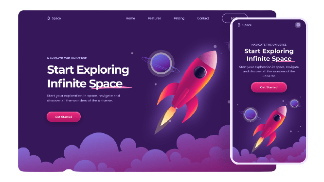

# Space & Beyond Landing Page



## About The Project

Welcome to the Space & Beyond Landing page! This website is designed to explore the wonders of the universe and navigate the infinite space. This landing page is fully responsive site.

## Requirements

- [git](https://git-scm.com/book/en/v2/Getting-Started-Installing-Git)
  - You'll know you did it right if you can run `git --version` and you see a response like `git version x.x.x`

# Built With

- [HTML](https://developer.mozilla.org/en-US/docs/Web/HTML)
- [Javascript](https://developer.mozilla.org/en-US/docs/Web/JavaScript)
- [CSS](https://developer.mozilla.org/en-US/docs/Web/CSS)
- [GSAP Animation](https://greensock.com/)

# Getting Started

- [Live Server](https://marketplace.visualstudio.com/items?itemName=ritwickdey.LiveServer)

  Use Live Server for a Quick Development Live Server with live browser reload.
  Launch VS Code Quick Open (Ctrl+P), paste the following command, and press enter.

  ```
  ext install ritwickdey.LiveServer
  ```

## Run the Repo

Clone this repo

```
https://github.com/vaasanthk/space-beyond.git
```

# Thank you!
